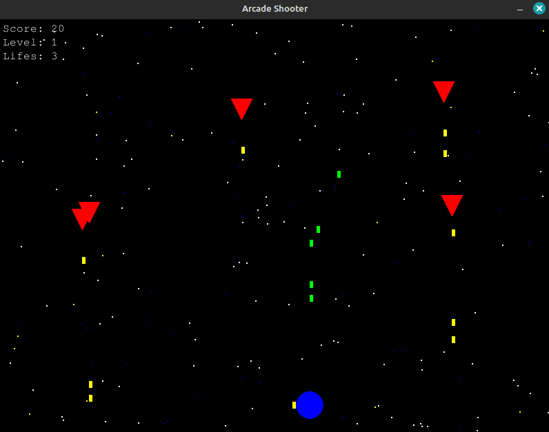
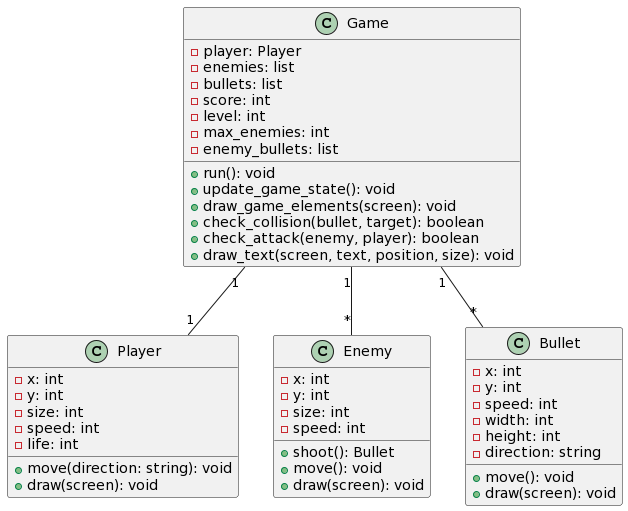

# Arcade Shooter Game
## Descripción
Este proyecto es un juego de disparos estilo arcade desarrollado en Python utilizando la biblioteca Pygame. El juego presenta un jugador que puede moverse horizontalmente y disparar a enemigos que aparecen en la parte superior de la pantalla. Los enemigos también pueden disparar hacia el jugador. El objetivo es evitar ser golpeado por los enemigos y sus balas mientras se intenta alcanzar la mayor puntuación posible.

<div align="center">
  
</div>
<!--  -->

## Características
- Movimiento del jugador de izquierda a derecha.
- Disparos del jugador y de los enemigos.
- Sistema de puntuación basado en enemigos derrotados.
- Niveles de dificultad que aumentan con la puntuación.
- Sistema de vidas para el jugador.

## ¿Cómo Jugar?
- Utiliza las teclas de flecha izquierda y derecha (←, →) para mover el jugador.
- Presiona la tecla de espacio (Space) para disparar.
- Evita las balas enemigas y destruye a los enemigos para ganar puntos.
- Sal del juego presionando las teclas Q o ESC.

## Relaciones entre Clases

El diagrama UML ilustra cómo las clases de nuestro juego interactúan entre sí. Aquí hay una descripción detallada de las relaciones y dependencias entre las clases:

<div align="center">
  
</div>

### Clase `Game`
La clase `Game` es la clase central que coordina el juego. Contiene instancias de otras clases y las utiliza para implementar la lógica y las reglas del juego.

- **Relaciones**:
  - **Player**: La clase `Game` tiene una relación uno a uno (`1`) con la clase `Player`. Esto significa que cada instancia de `Game` contiene una única instancia de `Player`, que representa al jugador en el juego.
  - **Enemy**: La clase `Game` mantiene una relación uno a muchos (`1..*`) con la clase `Enemy`. Esto indica que una instancia de `Game` puede contener múltiples instancias de `Enemy`, representando a los enemigos con los que el jugador debe luchar.
  - **Bullet**: Similar a la relación con `Enemy`, `Game` tiene una relación uno a muchos con `Bullet`. Esto refleja que el juego gestiona múltiples balas en la pantalla al mismo tiempo, disparadas tanto por el jugador como por los enemigos.

### Clase `Player`
La clase `Player` define las propiedades y comportamientos del jugador en el juego.

- **Relaciones**:
  - No tiene relaciones directas con otras clases en términos de propiedad, pero sí interactúa con la clase `Bullet` para disparar balas y con la clase `Enemy` para evitarlos o ser destruido por ellos.

### Clase `Enemy`
La clase `Enemy` define las propiedades y comportamientos de los enemigos en el juego.

- **Relaciones**:
  - **Bullet**: Los enemigos utilizan la clase `Bullet` para disparar balas hacia el jugador. Esto se representa con la operación `shoot()`, que crea una nueva instancia de `Bullet`.

### Clase `Bullet`
La clase `Bullet` representa las balas disparadas en el juego y maneja su movimiento y dibujo en la pantalla.

- **Relaciones**:
  - La clase `Bullet` no posee otras clases ni es poseída, pero es instanciada tanto por `Player` como por `Enemy` y es controlada por la clase `Game`.

### Comentarios Generales
Las clases `Player`, `Enemy`, y `Bullet` están todas conectadas a través de la clase `Game`, que actúa como un controlador que maneja el flujo del juego, las interacciones, y el estado general de la partida. La clase `Game` es responsable de crear, actualizar, y dibujar las instancias de estas clases, así como de verificar colisiones y actualizar el puntaje y las vidas del jugador.

## Detalles del Código
### Clase Player
Gestiona las acciones y el estado del jugador.

#### Métodos Principales:
- `move(direction)`: Mueve el jugador a la izquierda o a la derecha.
- `draw(screen)`: Dibuja el sprite del jugador en la pantalla.

### Clase Enemy
Define a los enemigos, incluyendo su movimiento y la capacidad de disparar.

#### Métodos Principales:
- `shoot()`: Permite a los enemigos disparar balas.
- `move()`: Controla el movimiento descendente de los enemigos.
- `draw(screen)`: Dibuja los sprites de los enemigos en la pantalla.

### Clase Bullet
Controla las balas disparadas tanto por el jugador como por los enemigos.

#### Métodos Principales:
- `move()`: Maneja el movimiento de las balas.
- `draw(screen)`: Dibuja las balas en la pantalla, cambiando el color según quién las dispara.

### Clase Game
Es el núcleo del juego, maneja la lógica principal.

#### Métodos Principales:
- `run()`: Bucle principal del juego que gestiona los eventos y actualiza el estado del juego.
- `update_game_state()`: Actualiza el estado del juego, como la posición de los sprites y la detección de colisiones.
- `draw_game_elements(screen)`: Renderiza todos los elementos del juego en la pantalla.
- `check_collision(bullet, target)`: Verifica si hay una colisión entre las balas y los enemigos o el jugador.

## Requisitos
- Python 3.x
- Pygame

## Instalación y Ejecución
Para jugar, necesitarás tener Python y Pygame instalados en tu máquina. Puedes descargar e instalar Pygame siguiendo las instrucciones en Pygame Website.

Una vez instalado, clona este repositorio y ejecuta el archivo principal:

```bash
git clone https://github.com/JoseThD/FinalProgramacion.git
```
Luego accede a al repositorio
```
cd tu-carpeta-del-proyecto
```
```
python3 main.py 
```
## Contribuciones
Este proyecto es de creación propia y se deja libre para su uso y distribución. Sin embargo, si deseas realizar modificaciones en el código o contribuir con mejoras, por favor, envía una solicitud previa a los siguientes correos para obtener la aprobación.

```
juannavarro139070@correo.itm.edu.co
```
```
Joseposada249672@correo.itm.edu.co
```

Estamos abiertos a ideas y sugerencias para mejorar el juego, pero nos gustaría mantener un registro y control sobre los cambios realizados. ¡Tus contribuciones son bienvenidas y apreciadas!


## Licencia
Este proyecto es de libre uso, pero cualquier modificación requiere aprobación previa. Para más detalles, contacta a los autores.

